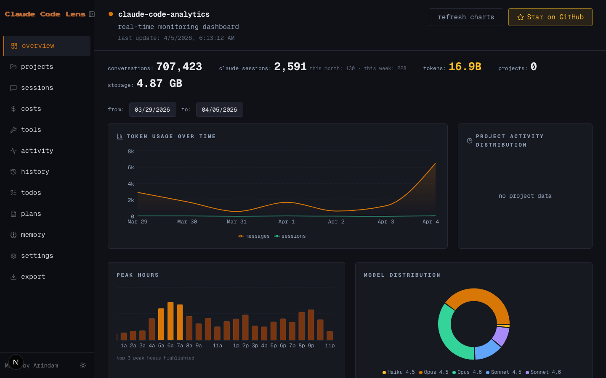

<div align="center">



# cc-lens

**Local-first analytics dashboard for [Claude Code](https://docs.anthropic.com/en/docs/claude-code)**

Visualize your token usage, costs, sessions, and projects — all from `~/.claude/`.\
Zero cloud. Zero telemetry. Your data never leaves your machine.

[](https://nodejs.org)
[](https://nextjs.org)
[](LICENSE)

</div>

---

## Quick Start

```bash
npx cc-lens
```

The CLI starts a local server on port `33033`, and opens the dashboard in your browser. No configuration needed.

## Fork Improvements

This is a fork of [Arindam200/cc-lens](https://github.com/Arindam200/cc-lens) with the following improvements:

| Area            | Before                           | After                                                             |
| --------------- | -------------------------------- | ----------------------------------------------------------------- |
| **Performance** | 22s page load on large histories | **0.34s** — mtime-based cache skips unchanged files (65x faster)  |
| **Security**    | Binds `0.0.0.0` — exposed on LAN | Binds **`127.0.0.1`** — localhost only by default                 |
| **Cost Charts** | Daily granularity, single view   | **1d / 7d / 30d / 90d / all** time windows with hourly drill-down |
| **UI**          | Fixed sidebar                    | Collapsible sidebar with icons, localStorage state                |

### Cost Visibility Details

- **Hourly chart** on 1d view — derived from JSONL session timestamps
- **Gap-fill** — populates dates missing from `stats-cache.json` using raw session data
- **Hero stats** — conversations, tokens, and cost reflect the selected time window

## Dashboard Pages

| Page         | What You See                                                                                                 |
| ------------ | ------------------------------------------------------------------------------------------------------------ |
| **Overview** | Token usage over time, project distribution, peak hours heatmap, model breakdown, recent conversations       |
| **Projects** | Card grid — sessions, cost, tools, languages, branches. Click through for per-project cost chart             |
| **Sessions** | Sortable table with filters (compacted, agent, MCP, web, thinking). Full session replay with per-turn tokens |
| **Costs**    | Stacked area chart by model, cost by project, per-model table, cache efficiency, pricing reference           |
| **Tools**    | Tool ranking by category, MCP server details, feature adoption, CC version history, branch chart             |
| **Activity** | GitHub-style contribution heatmap, streaks, day-of-week patterns, 24h peak hours                             |
| **History**  | Searchable, paginated command history from `history.jsonl`                                                   |
| **Memory**   | Browse and edit memory files across projects — filterable by type, with stale detection                      |
| **Todos**    | Todo lists with status filters and priority badges                                                           |
| **Plans**    | Saved plan files with inline markdown rendering                                                              |
| **Settings** | View `settings.json` — installed skills, plugins, configuration                                              |
| **Export**   | Download `.ccboard.json` or `.zip` with full JSONL. Import with merge preview                                |

## Configuration

| Variable       | Default     | Description                                            |
| -------------- | ----------- | ------------------------------------------------------ |
| `CC_LENS_PORT` | `33033`     | Server port                                            |
| `CC_LENS_HOST` | `127.0.0.1` | Bind address — warns if set to a network-accessible IP |

## Development

```bash
git clone https://github.com/pitimon/cc-lens.git
cd cc-lens
npm install
npm run dev
```

### Build for Production

```bash
npm run build
npm start
```

### Prerequisites

- Node.js 18+
- Claude Code session data in `~/.claude/`

## Data Sources

cc-lens reads the following paths under `~/.claude/`:

| Path                       | Description                    |
| -------------------------- | ------------------------------ |
| `projects/<slug>/*.jsonl`  | Session data (primary source)  |
| `stats-cache.json`         | Aggregated usage stats         |
| `usage-data/session-meta/` | Session metadata (fallback)    |
| `history.jsonl`            | Command history                |
| `todos/`                   | Todo lists                     |
| `plans/`                   | Saved plans                    |
| `memory/`                  | Memory files per project       |
| `settings.json`            | Skills, plugins, configuration |

Data auto-refreshes every 5 seconds while the dashboard is open.

## Tech Stack

- **Framework**: [Next.js 16](https://nextjs.org) (App Router, Turbopack)
- **Language**: TypeScript (strict mode)
- **UI**: [Tailwind CSS 4](https://tailwindcss.com), [Radix UI](https://www.radix-ui.com), [Lucide Icons](https://lucide.dev)
- **Charts**: [Recharts](https://recharts.org)
- **Data Fetching**: [SWR](https://swr.vercel.app) with 5s polling

## License

MIT

## Acknowledgments

Built on the foundation of [cc-lens](https://github.com/Arindam200/cc-lens) by [Arindam Majumder](https://github.com/Arindam200) — original architecture, session parser, and CLI distribution model.
